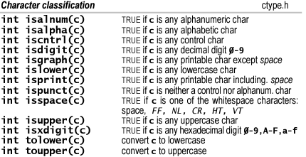

# High Level Programming Languages 1 — Lab 05 Overview

## Strings

Strings are actually one-dimensional array of characters terminated by a **null** character `\0`. Thus a null-terminated string contains the characters that comprise the string followed by a **null**.

<p align="center">
    
</p>

Hence, we can use one of the following statements to initialize a string:

```C
char hi[6] = {'H', 'e', 'l', 'l', 'o', '\0'};
```

```C
char hi[] = "Hello";
```

We can notice that the `null` character is not placed by a programmer, however the C compiler automatically places `/0` at the end of the string while initializing it.

Useful functions to manipulate strings in C available from `string.h` header file: 

You can find those functions in the [C reference](https://arato.inf.unideb.hu/panovics.janos/stdc.pdf) sheet.

|Function| Purpose |
|--------|---------|
|`strcpy(s1, s2);`|Copies string s2 into string s1|
|`strcat(s1, s2);`| Concatenates string s2 onto the end of string s1|
|`strlen(s1);`| Returns the length of string s1 |
|`strcmp(s1, s2);`| Returns 0 if s1 and s2 are the same, less than 0 if s1 < s2 , greater than 0 if s1 > s2|

### Example usage

```C
#include <stdio.h>
#include <string.h>

int main()
{

    char str1[12] = "Hello ";
    char str2[12] = "World";
    char str3[12];
    int len;

    /* copy str1 into str3 */
    strcpy(str3, str1);
    printf("strcpy(str3, str1):   %s\n", str3);

    /* concatenates str1 and str2 */
    strcat(str1, str2);
    printf("strcat(str1, str2):   %s\n", str1);

    /* total length of str1 after concatenation */
    len = strlen(str1);
    printf("strlen(str1):  %d\n", len);

    return 0;
}
```

### Read String from the user

You can use the `scanf()` function to read a string. This will read the sequence of characters until it encounters whitespace (space, newline, tab, etc.). 

```C
#include <stdio.h>
int main()
{
    char name[20];
    printf("Enter name: ");
    scanf("%s", name);
    printf("Your name is %s.", name);
    return 0;
}
```

Output:

```text
Enter name: Sandor Laszlo
Your name is Sandor.
```

Alternatively you can use the `fgets()` function to read a line of string. And, you can use `puts()` to display the string.

```C
#include <stdio.h>
int main()
{
    char name[30];
    printf("Enter name: ");
    fgets(name, sizeof(name), stdin);  // read string
    printf("Name: ");
    puts(name);    // display string
    return 0;
}
```

Output:

```text
Enter name: Tom Hanks
Name: Tom Hanks
```

> Note: The `gets()` function can also be to take input from the user. However, it is removed from the C standard.
> It's because `gets()` allows you to input any length of characters. Hence, there might be a buffer overflow.

Now remember, we can pass strings to functions but as arrays. Always remember while programming in C specifically that a string is just an array of characters.

---

## Memory Management

First of all let us show the functions we can use to manage and allocate memory. These functions can be found in the `<stdlib.h>` header file:

|Function       | Description|
|---------------|------------|
|`void *calloc(int num, int size);`| Allocates an array of `num` elements each of which size in bytes will be `size`|
|`void free(void *address);`| Releases a block of memory block specified by `address`|
|`void *malloc(size_t size);`| Allocates an array of `num` bytes and leave them **uninitialized**|
|`void *realloc(void *address, int newsize);`| Re-allocates memory extending it upto `newsize`|

### Why is it useful?

Yes, we can use predefined size arrays to store whatever we want. However, let us suppose a scenario where you do not know the length of the stored text. What we want to do is **dynamically** allocate enough memory space for it. We need to define a pointer to character without defining how much memory is required and later, based on requirement, we can allocate memory.

### Example

```C
#include <stdio.h>
#include <stdlib.h>
#include <string.h>

int main()
{

    char name[100];
    char *description;

    strcpy(name, "Istvan Laszlo");

    /* allocate memory dynamically */
    description = malloc(200 * sizeof(char));

    strcpy(description, "Istvan Laszlo is a 1st year CS student in University of Debrecen");
    

    printf("Name = %s\n", name);
    printf("Description: %s\n", description);
}
```

Alternatively we can use `calloc(200, sizeof(char));` instead of `malloc()`

### Resizing and Releasing Memory

The previous program will cause what we call a **Memory Leak**. A useful tool to check for memory leaks is [valgrind](https://valgrind.org/). *Please note, this tool is not available on windows. However, some IDEs like [CLion](https://www.jetbrains.com/clion/) and [Visual Studio](https://visualstudio.microsoft.com/) has their own implementations of memory management tools.*

Lets see valgrind's output to the terminal.

```text
==1072== Memcheck, a memory error detector
==1072== Copyright (C) 2002-2017, and GNU GPL'd, by Julian Seward et al.
==1072== Using Valgrind-3.18.1 and LibVEX; rerun with -h for copyright info
==1072== Command: ./test.o
==1072==
Name = Istvan Laszlo
Description: Istvan Laszlo is a 1st year CS student in University of Debrecen
==1072== 
==1072== HEAP SUMMARY:
==1072==     in use at exit: 200 bytes in 1 blocks
==1072==   total heap usage: 2 allocs, 1 frees, 1,224 bytes allocated
==1072==
==1072== LEAK SUMMARY:
==1072==    definitely lost: 200 bytes in 1 blocks
==1072==    indirectly lost: 0 bytes in 0 blocks
==1072==      possibly lost: 0 bytes in 0 blocks
==1072==    still reachable: 0 bytes in 0 blocks
==1072==         suppressed: 0 bytes in 0 blocks
==1072== Rerun with --leak-check=full to see details of leaked memory
==1072==
==1072== For lists of detected and suppressed errors, rerun with: -s
==1072== ERROR SUMMARY: 0 errors from 0 contexts (suppressed: 0 from 0)
```

As we can see there is a `definitely lost` part, how can we fix this?

We use `free(description);`. Now let us run valgrind again after adding this line. 

```text
==1078== Memcheck, a memory error detector
==1078== Copyright (C) 2002-2017, and GNU GPL'd, by Julian Seward et al.
==1078== Using Valgrind-3.18.1 and LibVEX; rerun with -h for copyright info
==1078== Command: ./test.o
==1078==
Name = Istvan Laszlo
Description: Istvan Laszlo is a 1st year CS student in University of Debrecen
==1078== 
==1078== HEAP SUMMARY:
==1078==     in use at exit: 0 bytes in 0 blocks
==1078==   total heap usage: 2 allocs, 2 frees, 1,224 bytes allocated
==1078==
==1078== All heap blocks were freed -- no leaks are possible
==1078==
==1078== For lists of detected and suppressed errors, rerun with: -s
==1078== ERROR SUMMARY: 0 errors from 0 contexts (suppressed: 0 from 0)
```

as we can see, no leaks are possible.

---

We can also resize the given memory if it is not sufficient for us, using `realloc()`

### Example

```C
#include <stdio.h>
#include <stdlib.h>
#include <string.h>

int main()
{

    char name[100];
    char *description;

    strcpy(name, "Istvan Laszlo");

    /* allocate memory dynamically */
    description = malloc(33 * sizeof(char));

    strcpy(description, "Istvan Laszlo a Unideb student. ");

    /* suppose you want to store bigger description */
    description = realloc(description, 100 * sizeof(char));

    strcat(description, "He is a CS student.");
    

    printf("Name = %s\n", name);
    printf("Description: %s\n", description);

    /* release memory using free() function */
    free(description);
}
```

If we did not use `realloc()`, running the program itself would cause an error. 

```text
malloc(): corrupted top size
Aborted
```

---

## `<ctype.h>`

You can find those functions in the [C reference](https://arato.inf.unideb.hu/panovics.janos/stdc.pdf) sheet.

<p align="center">
    
</p>
